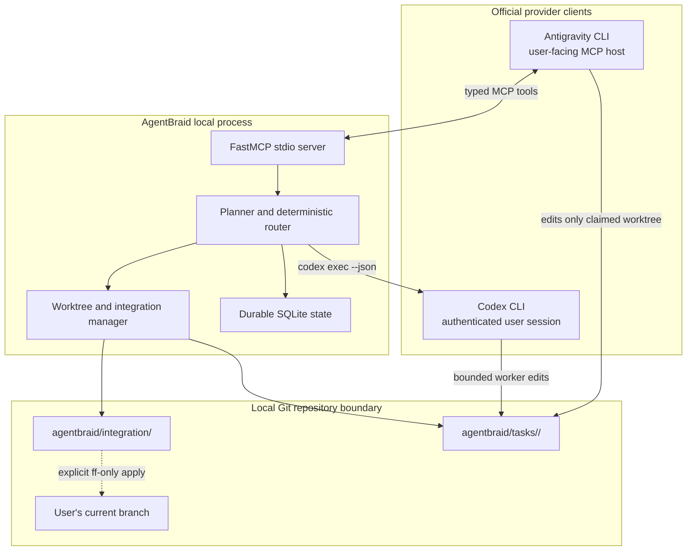
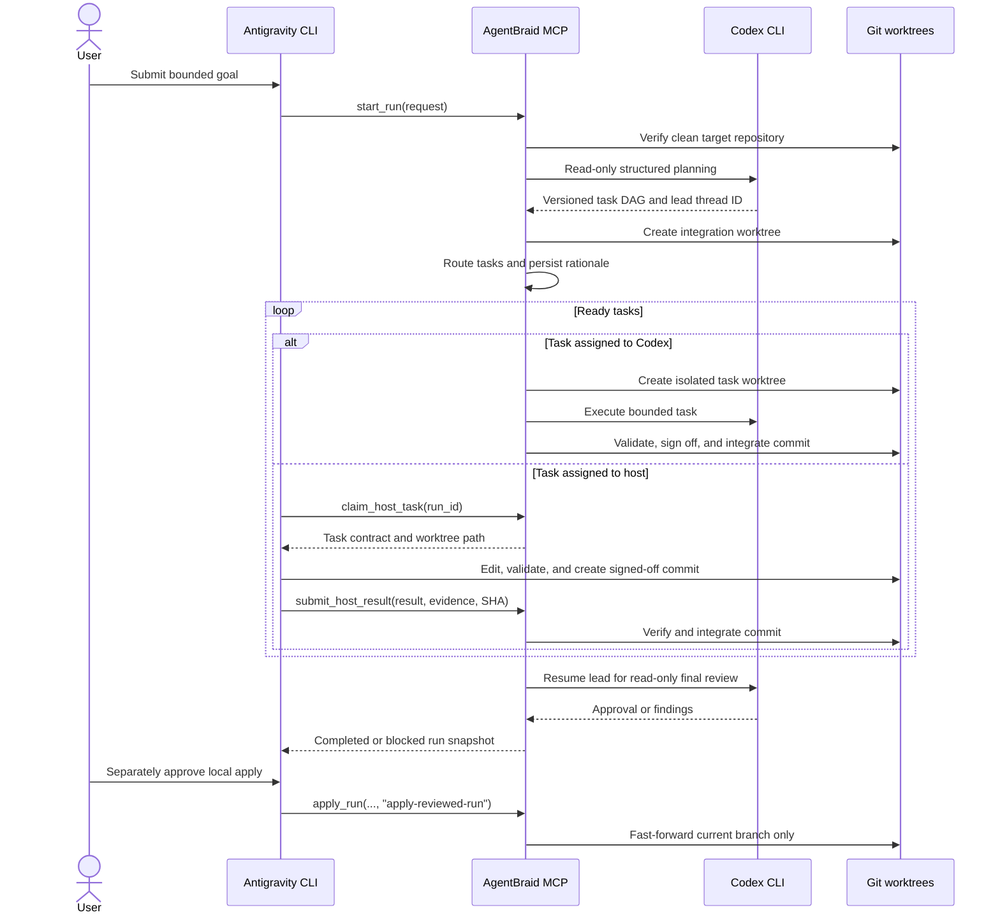

# Architecture

## Principles

1. **One accountable lead.** Codex owns the global plan, routing rationale, integration, and
   final review for a run.
2. **Host mediation.** The active MCP host claims explicitly assigned tasks and reports typed
   results; AgentBraid does not control or authenticate as that host.
3. **Isolation before concurrency.** Mutating worker tasks use separate Git worktrees and local
   commits before integration.
4. **Durable orchestration.** Runs and tasks survive process restarts through SQLite state.
5. **Least privilege.** Planning is read-only, writes are workspace-scoped, and remote delivery
   is always explicit.

## Components



### MCP server

Exposes the public run lifecycle: start, claim host work, submit host results, inspect, cancel,
list capabilities, and apply an integration branch.

### Codex lead

Runs in a read-only sandbox to produce a validated task DAG. Its thread ID is persisted and
resumed for integration decisions and final review.

### Codex workers

Execute bounded tasks in per-task worktrees. A successful mutating task must return validation
evidence and a local commit SHA. Branch naming, conflict recovery, and explicit delivery are
documented in `docs/worktrees.md`.

### Scheduler

Selects `codex` or `host` using task fit, historical outcomes, availability, latency, and risk.
The scoring policy is deterministic and its rationale is stored with the assignment. The fixed
v0.1 weights and hard availability rules are documented in `docs/routing.md`.

### State store

SQLite records runs, tasks, dependencies, attempts, events, capabilities, worktrees, and review
findings. Runtime state lives outside the repository by default.

## Run lifecycle



```text
created -> planning -> running -> integrating -> reviewing -> completed
                              \-> blocked
                    \-> cancelled
```

Each task follows:

```text
pending -> ready -> running -> succeeded
                         \-> retrying -> running
                         \-> failed
                         \-> cancelled
```

## Trust boundaries

- Prompts, model output, web content, and repository instructions are untrusted input.
- Provider credentials stay inside official provider clients.
- AgentBraid passes goals and task context, never raw authentication material.
- Child workers receive a recursion marker and cannot create nested AgentBraid runs.
- Pushes, deployments, and destructive cleanup require an explicit caller action.
- Provider child environments are credential-scrubbed, persisted strings are redacted, and
  runtime paths cannot target credential-bearing directories. See `docs/security-boundaries.md`.

## Public compatibility

MCP schemas are versioned independently from the package. During alpha, incompatible schema
changes are allowed when documented in `CHANGELOG.md`.
