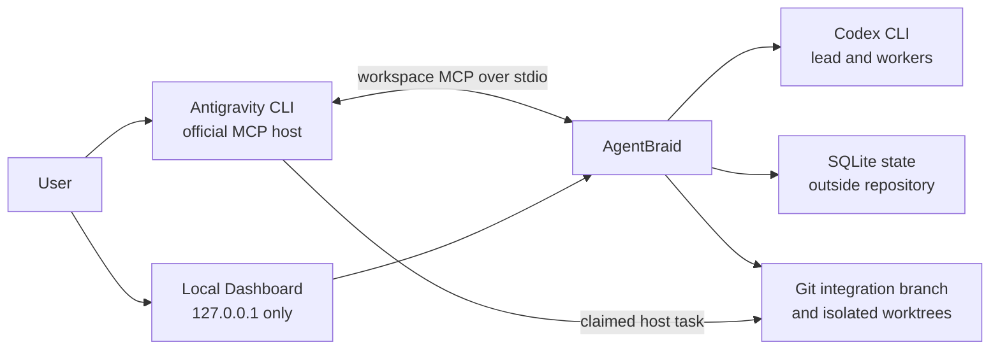

# AgentBraid

**Braid multiple agents into one accountable workflow.**

AgentBraid is a local-first MCP orchestration server that uses Codex as the lead planner and
integrator while an MCP host can execute specialist tasks. The first public alpha is designed
for Antigravity as the user-facing host and Codex CLI as the background engineering worker.

> [!WARNING]
> AgentBraid is pre-release software. MCP contracts and persisted state may change before 1.0.

## Why AgentBraid?

- Keep one accountable Codex lead for planning, routing, integration, and review.
- Delegate bounded tasks to the active MCP host without launching or impersonating that host.
- Isolate mutating Codex work in Git worktrees and integrate verified commits in DAG order.
- Record task decisions, retries, reviews, and outcomes in local SQLite state.
- Visualize task DAGs, durable events, provider usage, retries, and delivery readiness locally.
- Reuse each provider through its documented client and the user's own authorization.

## Architecture



AgentBraid never launches `agy`, reads Antigravity credentials, or proxies Google account
access. See [`docs/provider-policy.md`](docs/provider-policy.md) and
[`docs/security-boundaries.md`](docs/security-boundaries.md) for the supported boundary.
The detailed component and sequence diagrams are in [`ARCHITECTURE.md`](ARCHITECTURE.md).

## Quick start

Prerequisites:

- Python 3.11+
- Git 2.35+
- Codex CLI on `PATH`, signed in with `codex login`
- Antigravity CLI signed in with the user's own account
- A clean target Git repository

```bash
git clone https://github.com/xuu33030/agentbraid.git
cd agentbraid
python -m venv .venv
source .venv/bin/activate
python -m pip install .

cd /path/to/your/git-repository
agentbraid doctor .
agentbraid init .
agy
```

On Windows PowerShell, activate with `.venv\Scripts\Activate.ps1` and use a Windows path for
the target repository. Keep the virtual environment: the generated MCP configuration records its
absolute Python interpreter.

Inside Antigravity, use `/mcp` to confirm the `agentbraid` server is connected, `/skills` to
confirm the workspace skill is loaded, then start with a bounded goal such as:

```text
/agentbraid Add a tested health endpoint. Do not change authentication, push, or deploy.
```

`agentbraid init` writes `.agents/mcp_config.json` and
`.agents/skills/agentbraid/SKILL.md`. AgentBraid produces a reviewed local integration branch;
updating the current branch remains a separate, explicit `apply_run` action.

In another terminal, open the local Dashboard for the current workspace and every workspace
recorded in the same AgentBraid state database:

```bash
agentbraid dashboard .
```

The Dashboard binds only to `127.0.0.1`, uses an ephemeral authenticated browser session, and can
inspect, cancel, or explicitly apply existing runs. Starting runs and completing host tasks remain
inside Antigravity.

For complete platform instructions and the MCP tool sequence, read
[`docs/getting-started.md`](docs/getting-started.md) and
[`docs/host-walkthrough.md`](docs/host-walkthrough.md).

## Documentation

- [`docs/getting-started.md`](docs/getting-started.md): setup, first run, and local Dashboard
- [`docs/host-walkthrough.md`](docs/host-walkthrough.md): host task protocol and MCP tool reference
- [`docs/sample-run.md`](docs/sample-run.md): redacted, schema-valid run transcript
- [`docs/troubleshooting.md`](docs/troubleshooting.md): common setup, task, Git, and quota failures
- [`ARCHITECTURE.md`](ARCHITECTURE.md): components, lifecycle, trust boundaries, and diagrams
- [`docs/routing.md`](docs/routing.md): deterministic assignment policy
- [`docs/worktrees.md`](docs/worktrees.md): isolation, integration, review, and local apply

## Development status

The [public roadmap](ROADMAP.md) tracks implementation work. Contributions are
welcome through issue-first pull requests; see [`CONTRIBUTING.md`](CONTRIBUTING.md).

## Security and provider terms

- Never commit provider credentials, model transcripts, or AgentBraid runtime databases.
- Every user must authenticate directly with each provider and follow its current terms.
- AgentBraid does not bypass quotas, share subscriptions, or expose a provider login to others.
- Model output is untrusted until project validation and review pass.

Report vulnerabilities privately using [`SECURITY.md`](SECURITY.md).

## License

Licensed under the [Apache License 2.0](LICENSE).

AgentBraid is an independent open-source project. It is not affiliated with, endorsed by, or
sponsored by OpenAI or Google.
